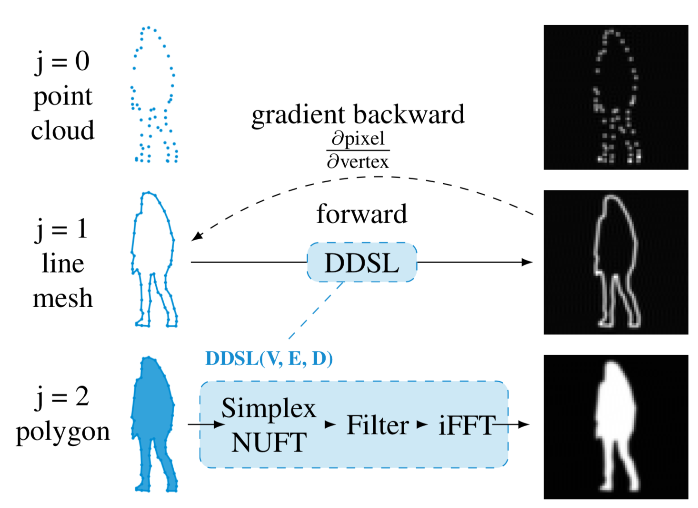

## DDSL: Deep Differential Simplex Layer for Neural Networks

### Introduction
In this project, we present a novel neural network layer that performs differentiable rasterization of arbitrary simplex-mesh-based geometrical signals (e.g., point clouds, line mesh, triangular mesh, tetrahedron mesh, polygon and polyhedron) of arbitrary dimensions. We further provide examples of incorporating the DDSL into neural networks for tasks such as polygonal image segmentation and neural shape optimization (for MNIST digits and airfoils).

Our deep learning code base is written using [PyTorch 1.0](https://pytorch.org/) in Python 3, in conjunction with standard Python packages such as [Numpy](http://www.numpy.org/). PyTorch version > 1.0 is required.

### Using the DDSL layer for your applications
We provide an efficient natively PyTorch-based implementation of the DDSL. Detailed documentation for APIs can be found in [ddsl/ddsl.py](ddsl/ddsl.py). For examples on using the DDSL implementation for rasterizing a given input mesh, refer to the jupyter notebooks in the folder [examples](./examples).

### Experiments
To replicate the experiments in our paper, please refer to codes in the [experiments](./experiments) folder. Detailed instructions for each experiment can be found in 

